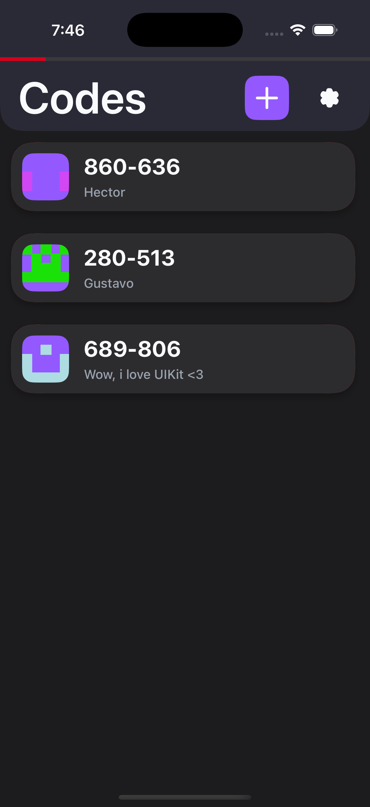
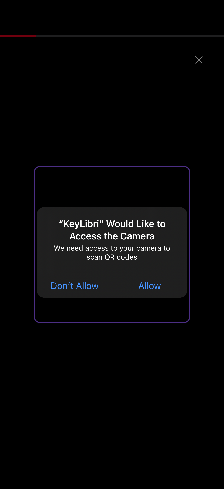
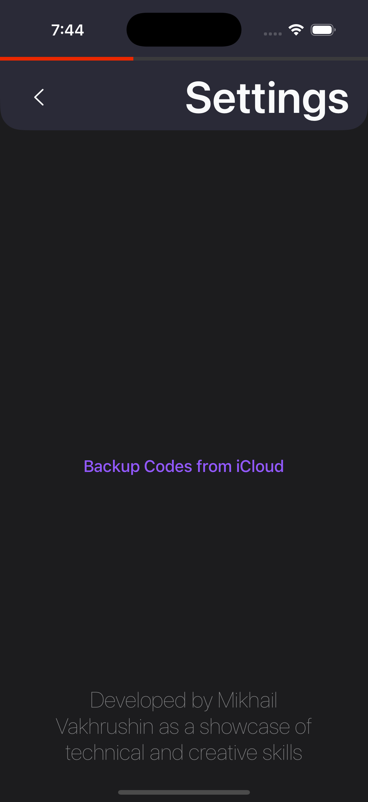
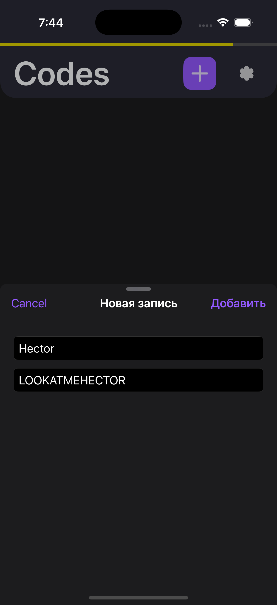
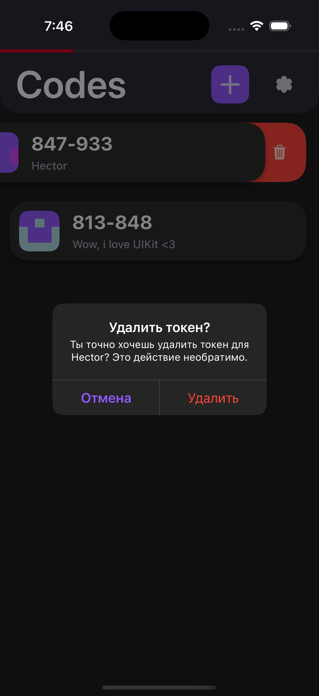

# KeyLibri

KeyLibri — это **iOS-приложение для генерации одноразовых TOTP-кодов** (как Google Authenticator), но **с крутым дизайном**, **айклауд-бэкапами** и **генерацией уникальных иконок** для каждого токена. 

> Хранишь свои коды, не боишься потерять их, и кайфуешь от интерфейса.

---

## Особенности

- **TOTP генерация** (принимает токены HEX и Base32 и проверяет их уникальность из-за системы хранения основанной на принудительной конвертации кода в хекс для определения внутри.
- **Keychain** для безопасного хранения секретов.
- **iCloud Backup** — автоматическая синхронизация между устройствами.
- **Уникальные иконки** (Identicon) на базе SHA256.
- **Firebase Analytics** — как пример умения работать с этим делом.
- **Realm** — база данных для быстрых офлайн-операций.
- **Viper архитектура** — *без комментариев*.

---

## Стек технологий

- **UIKit** — Кайфанул от старости.
- **CryptoKit** — для HMAC и SHA256 (TOTP и генерация иконок).
- **Realm** — легковесная база данных.
- **Keychain Access** — безопасное хранение секретов.
- **iCloud (NSUbiquitousKeyValueStore)** — синхронизация бэкапов.
- **Firebase Analytics** — сбор аналитики, debugview в комплекте.

---

## Примеры
<h2>Скриншоты</h2>

  
  
  
  
  

